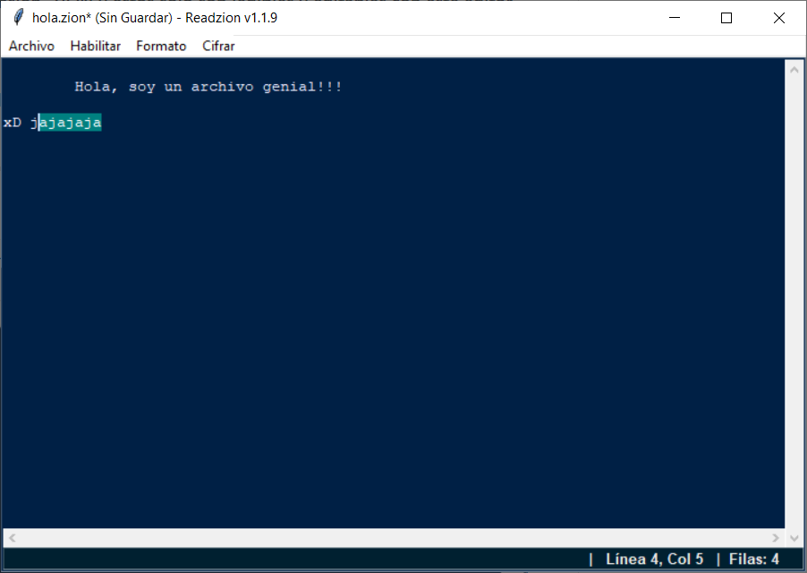

# Readzion v1.1.9
 __Notepad especializado en lectura y escritura cifrada de archivos con extensión .ZION__
## By: LawlietJH
## Python 3
## Funcionamiento:

__El Programa genera archivos de texto cifrados con extensión .ZION y estos solo son legibles y editables con este editor de archivos llamado Readzion.__

__Se tiene la posibilidad de recuperar texto de un archivo abierto anteriormente al generar un archivo Nuevo, tan solo dejando presionado Ctrl+Z unos instantes. Esto es con la finalidad de recuperar texto erroneamente no guardado en algun archivo anterior.__

---
## Capturas:

